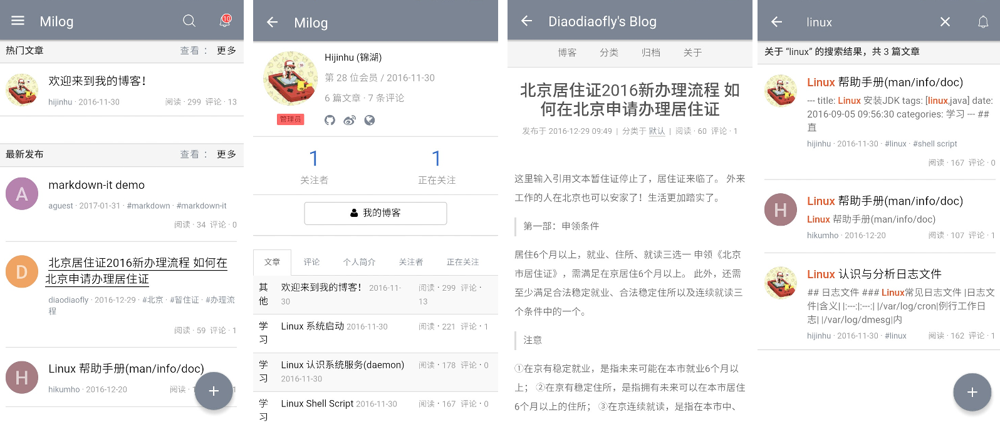

# Milog for Android

Milog Android 客户端，基于 Turbolinks + Rails + Android Native 的方式实现

## Thanks

+ [Turbolinks Android](https://github.com/turbolinks/turbolinks-android)

+ [ruby-china-android](https://github.com/ruby-china/ruby-china-android)

## 开发

+ Git pull 代码到本地

+ 若本地部署 [Milog](https://github.com/HiKumho/milog) 后, 可修改 `Constants.java` 文件中 `HOST_URL` 的指向, 注意要开放本地的端口, 如开放 3000 端口 `/sbin/iptables -I INPUT -p tcp --dport 3000 -j ACCEPT`

## 效果截图

